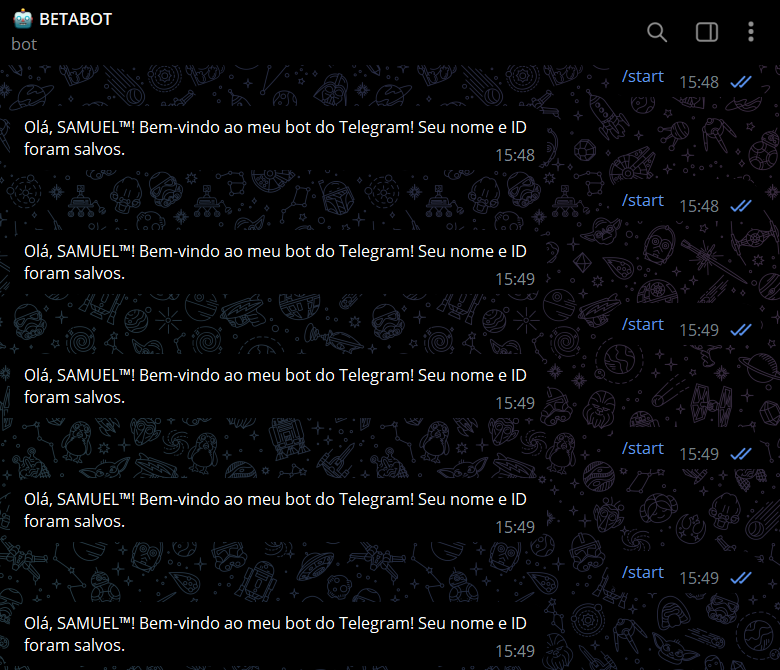
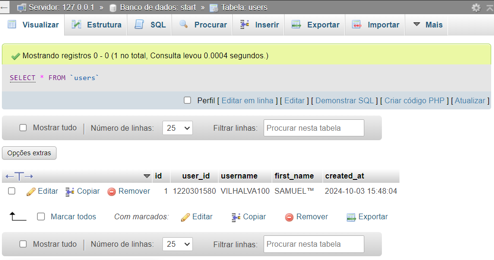

# START BOT COM MYSQL
🤤ESTE BOT EM PHP É UM EXEMPLO SIMPLES DE COMO VOCÊ PODE COMBINAR A API DE BOTS DO TELEGRAM COM UM BANCO DE DADOS MYSQL PARA ARMAZENAR INFORMAÇÕES DOS USUÁRIOS.

 <br>
 <br>

## DESCRIÇÃO:
Este bot do Telegram foi desenvolvido para interagir com os usuários e, ao mesmo tempo, registrar suas informações em um banco de dados MySQL. Ele coleta o ID do usuário, nome de usuário (se houver), nome e a data e hora em que o comando `/start` é enviado. Isso pode ser útil para rastrear usuários, criar um sistema de gerenciamento de usuários ou até mesmo para personalizar interações futuras.

## FUNCIONALIDADES:
1. **Boas-vindas e Salvamento de Dados**:
   - Quando o usuário envia o comando `/start`, o bot responde com uma mensagem de boas-vindas personalizada, mencionando o nome do usuário.
   - Ele também armazena os seguintes dados no banco de dados MySQL:
     - **ID do usuário**: O ID único do usuário no Telegram.
     - **Nome de usuário**: O nome de usuário do Telegram (se disponível).
     - **Primeiro nome**: O nome da pessoa conforme registrado no Telegram.
     - **Data e hora**: O horário em que o usuário iniciou a interação com o bot.

2. **Verificação de Duplicidade**:
   - Antes de inserir os dados no banco de dados, o bot verifica se o usuário já foi registrado anteriormente, evitando a duplicação de registros.

3. **Resposta Personalizada**:
   - O bot envia uma mensagem de resposta dizendo que o nome e o ID do usuário foram salvos com sucesso.

## EXECUTANDO O PROJETO:
1. **Importar o `DATABASE.sql`**  
   - Antes de iniciar o bot, é necessário importar o arquivo localizado em `./CODIGO/DATABASE.sql` para o seu banco de dados MYSQL.

2. **Configuração do Bot**:
   - O arquivo `./CODIGO/config.php` deve conter o [token do bot](https://t.me/BotFather) e as credenciais do banco de dados MYSQL:
     ```php
     <?php
     // Configurações do Bot
     define('TOKEN', 'COLOQUE_SEU_TOKEN_AQUI');

     // Configurações do Banco de Dados
     define('DB_HOST', 'localhost');
     define('DB_NAME', 'start');
     define('DB_USER', 'seu_usuario');
     define('DB_PASS', 'sua_senha');
     ```

3. **Iniciar o Bot**:
   - Execute o script `index.php` em seu servidor ou localmente, se estiver configurado corretamente com um ambiente de servidor que permita long polling.
   - No terminal, rode o bot com:
     ```bash
     php index.php
     ```

4. **Interação com o Bot**:
   - No Telegram, procure pelo bot (criado via o BotFather) e envie o comando `/start`.
   - O bot responderá com uma mensagem de boas-vindas e salvará os dados do usuário no banco de dados MySQL.

## NÃO SABE?
- Entendemos que para manipular arquivos em muitas linguagens e tecnologias relacionadas, é necessário possuir conhecimento nessas áreas. Para auxiliar nesse aprendizado, oferecemos alguns subsidios:
* [VEJA A DOCUMENTAÇÃO](https://core.telegram.org/bots/api)
* [CURSO SUGERIDO](https://github.com/VILHALVA/CURSO-DE-TELEBOT)
* [CURSO DE PHP](https://github.com/VILHALVA/CURSO-DE-PHP)
* [CURSO DE MYSQL](https://github.com/VILHALVA/CURSO-DE-MYSQL)
* [CURSO DE PHP COM MYSQL](https://github.com/VILHALVA/CURSO-DE-PHP-COM-MYSQL)
* [CONFIRA MAIS CURSOS](https://github.com/VILHALVA?tab=repositories&q=+topic:CURSO)

## CREDITOS:
- [PROJETO CRIADO PELO VILHALVA](https://github.com/VILHALVA)
